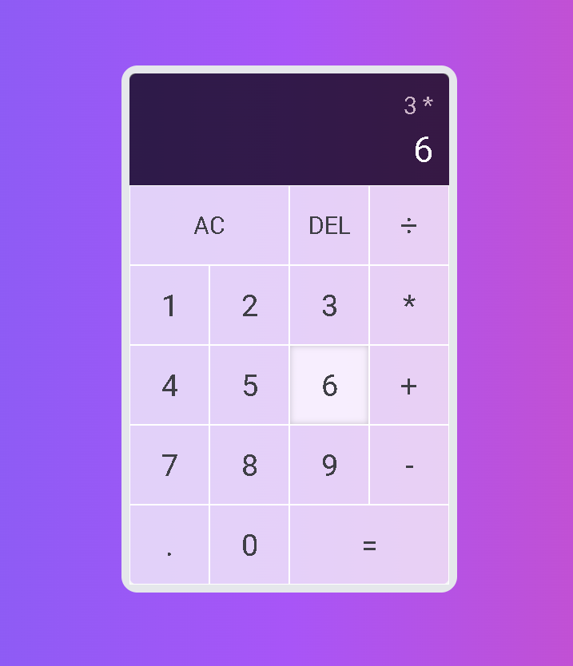

# Application "Calculator"

Everyone knows what a calculator is and what it does.

## Table of contents

- [Overview](#overview)
  - [Information](#information)
  - [Screenshot](#screenshot)
  - [Links](#links)
- [My process](#my-process)
  - [Built with](#built-with)
  - [What I learned](#what-i-learned)

## Overview

### Information

This is a standard calculator application (plus, minus, division, multiplication).

### Screenshot

### Links

- [Live Site URL](https://calculator-syrniki.netlify.app/)

## My process

### Built with

- HTML
- JS
- React JS
- Tailwind CSS
- vite
- Howler JS

### What I learned

Using Tailwind CSS, learning React hook useReducer(), connecting a music library Howler JS.

